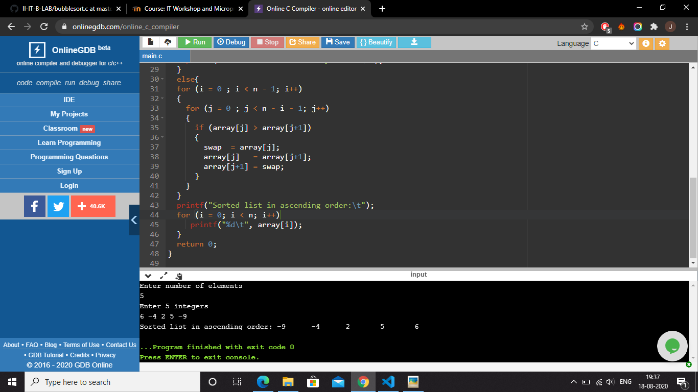

# Bubble Sort
## Aim of the experiment:
To perform bubble sort of a sorted array and two unsorted arrays.
###### Array (i):   1, 2, 3, 4, 5.
###### Array (ii):  6, -4, 2, 5, -9.
###### Array (iii): 8, 6, 4, 7, 2.

## Brief description of Bubble sort:
Bubble Sort is a simple algorithm which is used to sort a given set of n elements provided in form of an array with n number of elements. Bubble Sort compares all the element one by one with the adjacent elements and sort them based on their values.

If the given array has to be sorted in ascending order, then bubble sort will start by comparing the first element of the array with the second element, if the first element is greater than the second element, it will swap both the elements, and then move on to compare the second and the third element, and so on.

If we have total n elements, then we need to repeat this process for n-1 times.

## Step-by-step-procedure:
##### 1. Starting with the first element, compare the current element with the next element of the array.
##### 2. If the current element is greater than the next element of the array, swap them.
##### 3. If the current element is less than the next element, move to the next element. 
##### 4. Repeat Step 1.

## Output obtained:

### (i) Bubble sorting of sorted array
#### Procedure of obtaining output:
1. Read elements of the array and number of the array elements.
2. Here n = 5 and array = {1, 2, 3, 4, 5}
3. In bubble sorting, the elements of the array are swapped and arranged in ascending order.
4. But, in this case, the elements are already sorted.
5. So, after entering the elements(that are already sorted), it prints "The elements are already sorted."

### (ii) Bubble sorting of sorted array
#### Procedure of obtaining output:
1. Read elements of the array and number of the array elements.
2. Here n = 5 and array = {6, -4, 2, 5, -9}
3. As the number of elements are 5, the number of iterations will be 4(n-1).
4. Starting with the first element(6),it compares itself with the adjacent element(-4).
5. As 6 is greater than -4, it swaps with -4 and -4 becomes the first element.
6. Now second element is 6, it again compares with it's adjacent element 2.
7. And as again 6 is greater than 2, it swaps.So 2 becomes the second element.
8. Now, the third element 6, compares to 5. And as 5 is smaller than 6, it swaps.
9. Further, the fourth element 6 swaps with -9 as -9 is smaller than 6.
10. And here, the greatest element(6) remains at the last, as the iteration 1 ends.
11. All the further iterations follow the same pattern, resembling from step 4.
12. At the end,the elements are sorted and the ouput gets printed in the sorted order as "-9, -4, 2, 5, 6."

### (iii) Bubble sorting of unsorted array
#### Procedure of obtaining output:
1. Read elements of the array and number of the array elements.
2. Here n = 5 and array = {8, 6, 4, 7, 2}
3. As the number of elements are 5, the number of iterations will be 4(n-1).
4. Starting with the first element(8),it compares itself with the adjacent element(6).
5. As 8 is greater than 6, it swaps with 6 and 6 becomes the first element.
6. Now second element is 8, it again compares with it's adjacent element 4.
7. And as again 8 is greater than 4, it swaps.So 4 becomes the second element.
8. Now, the third element 8, compares to 7. And as 7 is smaller than 8, it swaps.
9. Further, the fourth element 8 swaps with 2 as 2 is smaller than 8.
10. Here the greatest element(8) remains at the last. And the iteration 1 ends.
11. All the further iterations follow the same pattern, resembling from step 4.
12. At the end,the elements are sorted and the ouput gets printed in the sorted order as "2, 4, 6, 7, 8."

