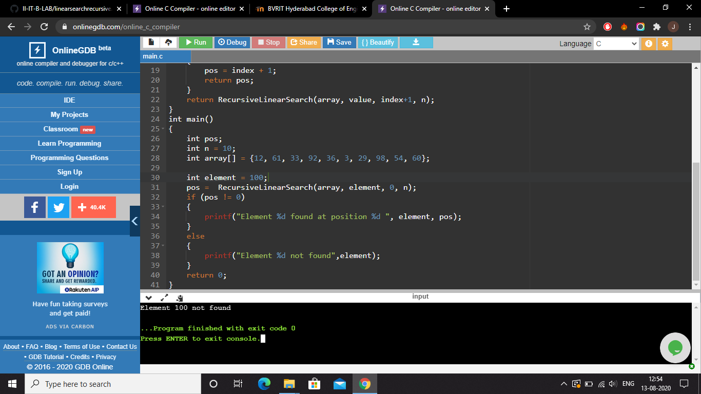

#  Linear Search and Binary search

## Aim of the Experiment
Write a program that use both recursive and non-recursive functions to perform the following searching operations for a Key value in a given list of integers:
Array : 12, 61, 33, 92, 36, 3, 29, 98, 54, 60
(i) Linear search
Key element to be searched : 36, 100
(ii) Binary search
Key element to be searched : 12, 92, 33

### Brief description of Linear search and Binary search
Searching is the process used to find the location of a target among a list of objects.
There are two basic searches for arrays:
1. The linear search : In the linear search , we start searching for the target from the
   beginning of the list, and we continue until the we find the target or
   until we are sure that it is not in the list.

2. The binary search : The binary search starts by testing the data in the element at the middle of the list. 
   This determines if the target is in first half or second half of the list.
   If it is in first half , we do not need to check the second half.
   If it is in second half , we do not need to check the first half.
   In other words ,either way we eliminate half the list from further consideration.
   We repeat this process until we find the target or satisfy ourselves
   that it is not in the list. 
   To find the middle of the list we three variables,
   one to identify the beginning of the list(first),
   one to identify the beginning of the list(mid),
   one to identify the beginning of the list(last),
   where mid=( first + last )/2
   

#### Step-by-step procedure
##### Linear search
###### 1.start
###### 2.read n
###### 3.read elements of list (a[])
###### 4.read element to be searched(item)
###### 5.initialize found=0
###### 6. for(i=0;i<n;i++)
###### 7. {
###### If(a[i]==item)
###### {
###### found=1
###### Break
###### }
###### }
###### 8.if (found==1)
###### then print element a[i] is found i th location
###### else
###### print element not found
###### 9.stop

##### Binary search
###### 1.start
###### 2.read n
###### 3.read elements of list (a[])
###### 4.read first = 0 last = n - 1,  mid
###### 5.read element to be searched(item)
###### 6.while ( first <= last ) {
###### 7.mid = (first + last) / 2;
###### if ( a[mid] == target )
###### return mid;
###### if ( a[mid] > target )
###### last = mid - 1;
###### else
###### first = mid + 1;
###### }
###### return -1:
###### }
###### 8.if (found==1)
###### then print element a[i] is found i th location
###### else
###### print element not found
###### 9.stop

#### Output obtained

